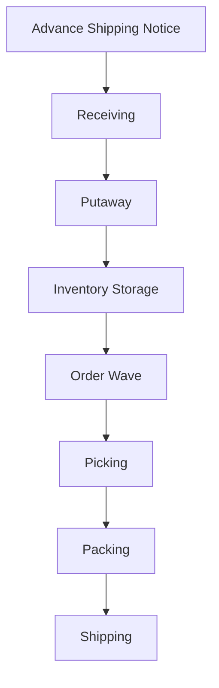

# WMS Workflow Simulator
A comprehensive Warehouse Management System (WMS) workflow simulation designed for QA Engineering and logistics testing.
This project covers inbound, inventory, outbound, and value-added services (VAS).

## 🎯 What This Project Demonstrates
- End-to-end functional testing in multi-module WMS environments
- Business workflow validation across receiving, putaway, picking, packing, and shipping
- Cross-functional data dependency analysis
- Risk-based testing methodologies for high-volume fulfillment
- Domain expertise in warehouse operations and supply chain
- System behavior verification under exceptions
- Professional QA documentation and defect investigation practices

## 📦 Modules Included
### 1. Inbound Operations
- Advance Shipping Notice (ASN)
- Receiving (Blind & Expected)
- Quality Inspection (QA)
- Putaway (Directed & Manual)
### 2. Inventory Management
- Cycle Counting
- Stock Transfers & Replenishment
- Location Management (Bins, Zones)
- Expiry & Lot Control
### 3. Outbound Operations
- Order Allocation (Wave Planning)
- Picking (Batch, Zone, Discrete)
- Packing & Cartonization
- Shipping & Manifesting
### 4. Value-Added Services (VAS)
- Kitting & Assembly
- Labeling & Repackaging

## 📸 System Architecture Diagram (Mermaid)

